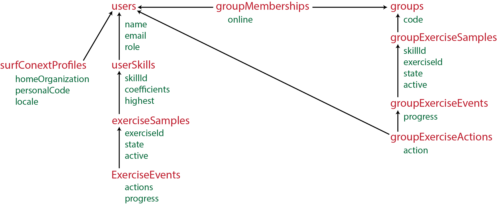

# Step-Wise Database

The database consists of numerous tables, connected to each other through various links. The overview below describes the various subsystems and which tables they use.

## User registration

For User registration there are these tables.

- `users` contains all general User-related data, like `name`, `email`, `role` and which privacy policy version was accepted.
- `surfConextProfiles` is an extension for those users who logged in through SurfConext. It contains their organization (university, school, etcetera) and their unique code within that organization (like a student ID).

## Individual practice

For individual practice we must track a user's skills as well as provide exercises.

### Skill tracking

For skill tracking there is only one table.

- `userSkills` contains data on how proficient a user is in a certain skill. It has a `userId` and a `skillId` (the latter is a code-defined string like `addition`) which together form a unique combination. On top of this, it remembers the performance `coefficients` as well as the `highest` coefficients that were ever obtained for this skill.

### Individual exercises

To provide individual users with exercises, there are the following tables.

- `exerciseSamples` represent randomly generated exercises for users. It has a `userSkillId` and an `exerciseId` (the latter is a code-defined string like `additionSimpleExercise1`) which together form a unique combination. On top of this there is the exercise `state`, which is the collection of randomly generated numbers/parameters for this exercise, and a boolean `active` whether this exercise is still active. For every `userSkill` only (at most) one exercise should be active at any time.
- `exerciseEvents` represent any event/action the user does for the exercise. Think of an input submission or simply giving up. It has an `exerciseSampleId` (for which exercise is this event) an `action` parameter (what did the user do?) and a `progress` parameter (how far along was the student after said action?) to track everything.

## Group practice

For group practice there is another set of tables.

### Group registration

To track group registration and activity there are these tables.

- `groups` representing a group of student. Every group is uniquely identified by a brief `code`.
- `groupMemberships` providing the n-to-n link between `users` and `groups`. It tracks which users are in which groups. An extra parameter is the `active` parameter, showing whether the user is active in the group now.

### Group exercises

To let groups practice on the same exercises, there is a set of tables providing these exercises. They are similar but not identical to the individual exercise tables.

- `groupExerciseSamples` represent the exercises a group can work on. It points to a `groupId` and has both a `skillId` (like `addition`) and an `exerciseId` (like `additionSimpleExercise`) field, neither of which are a unique combination. Additionally, there is an `active` parameter indicating whether the group is active. Every group has, for every `skillId`, only (at most) one exercise active at any time.
- `groupExerciseEvents` represent events for group exercises. This table only has one field `progress`, which stores the progress the group has made for the exercise.
- `groupExerciseActions` represent the actions users do (or submissions they make) for an exercise. It has a `groupExerciseEventId` and a `userId`, together a unique combination. It also has an `action` field.
